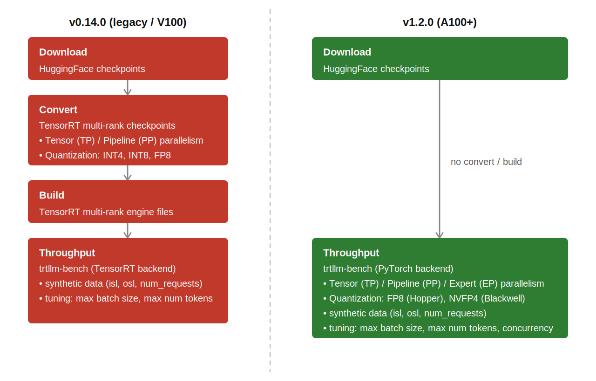
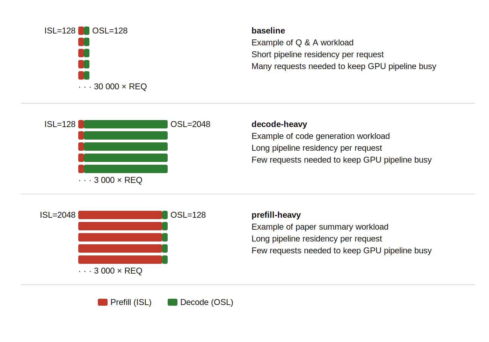
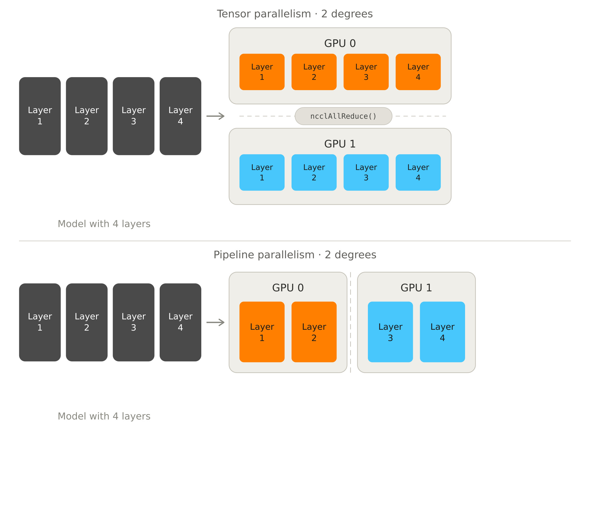
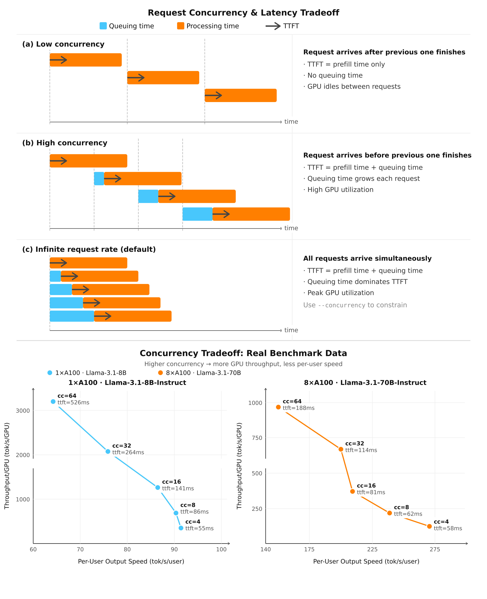

# KISTI HPC-AI Benchmark (KHAB)
## Overview 
KHAB offers a declarative approach to automations of HPC and AI applications benchmarks. 
- Each benchmark is declared with a set of sweepable parameters that affect the performance. 
- The framework serializes each combination into individual runs, steps through every parameter combination automatically, and summarizes the results

List of supported benchmark

| Benchmark     |  Target                           | Sweepable parameters                                                                             |
| ------------- | ----------------------------------| ------------------------------------------------------------------------------------------------ |
| STREAM        | CPU memory bandwidth              | `nthreads`, `place`, `bind`                                                                      |
| BabelStream   | GPU memory bandwidth              | `device`, `size`, `ntimes`                                                                       |
| HPL           | Dense linear algebra              | `nnodes`, `ntasks`,`ngpus`, `sizes`, `blocksizes`, `mem`, `broadcast`                            |
| TensorFlow2   | Training throughput               | `nnodes`, `ntasks`,`ngpus`,`nthreads`, `models`, `batch_sizes`                                   |
| VASP          | Mterials science                  | `nnodes`, `ntasks`,`ngpus`,`ntasks`,`ngpus`, `ncores`, `kpars`, `nsims`                          |
| TensorRT-LLM  | LLM inference throughput/latency  | `sharding` (`nnodes`,`pp`,`pt`), `max_batch_sizes`, `max_num_tokens`, `workloads`, `concurrency` |

## Architecture 
```
KHAB/
├── env.sh                     # PYTHONPATH modification
├── .gitignore
├── LICENSE
├── khab/                      # Core framework package
│   ├── bmt.py                 # Base class  
│   ├── device.py              # Device class
│   ├── cpu.py                 # CPU info 
│   ├── gpu.py                 # GPU info 
│   ├── mpi.py                 # MPI abstract class and launcher 
│   ├── launcher.py            # Abstract bmt launcher base class
│   ├── affinity.py            # OpenMP affinity presets (GNU, Intel)
│   ├── env.py                 # Module load/unload helpers
│   ├── util.py                # Helper utilities 
│   ├── report.py              # Output format and progress bar 
│   └── benchmarks/            # Derived benchmark classes 
│       ├── stream.py
│       ├── babelstream.py
│       ├── hpl.py
│       ├── tensorflow2.py
│       ├── vasp.py
│       └── llama3.py
└──examples/                   # Benchmark scripts 
    ├── run_stream.py
    ├── run_babelstream.py
    ├── run_hpl.py
    ├── run_tf2.py
    ├── run_vasp.py
    └── llama3/                  
        ├── run_llama3.py
        ├── a100.yaml
        └── v100.yaml
```

## Obtain the source code 
```
git clone https://github.com/vitduck/KHAB.git

cd KHAB
source env.sh 
```

## Environmental setup 
```
conda create -n khab python=3.12
conda activate khab

pip install pyyaml rich py-cpuinfo nvidia-ml-py ClusterShell
```
## Benchmarks

### STREAM

`StreamConfig` sweeps thread count and OpenMP affinity placement.

It wraps the classic [STREAM benchmark](https://www.cs.virginia.edu/stream/), the standard tool for measuring sustained memory bandwidth.
- `nthreads`: number of OpenMP threads
- `place`: which hardware units threads are pinned to (cores vs hardware threads)
- `bind`: how threads are distributed
    -  `spread` maximizes memory channel utilization across NUMA domains
    -  `close` clusters threads together and reduces cross-NUMA traffic
    -  For Zen architectures, one thread per CCX typically gives highest bandwidth due to localized L3 cache

Compiler and array size choices play a crucial role in archive optimal bandwidth

- Array size must be sufficiently large with respect to the CPU's L3 cache, e.g. 4x total cache size
- GCC does not automatically emit non-temporal (write-through) store instructions, leading to understated bandwidth. 
   - On Intel CPUs, Intel (R) oneAPI compilers emit non-temporal stores by default. 
   - On AMD CPUs, AMD Optimizing C/C++ and Fortran Compilers (AOCC) can also emit non-temporal stores 

```python
#!/usr/bin/env python

from affinity import GNU

from bmt import benchmark, report
from env import module_purge, module_load, module_list
from stream import StreamConfig

module_purge()
module_load(['gcc/15.2.0'])
module_list()

cfg = StreamConfig(
    bin = '<path-to-stream-binary>',
    outdir = './output',
    bind = 'spread',
    nthreads = [8, 16, 32]
)

results = benchmark(cfg, repeats=3)

report(results)
```

### BabelStream

`BabelStreamConfig` measures GPU (or CPU) memory bandwidth on a single device. 

It wraps [BabelStream](https://github.com/UoB-HPC/BabelStream), a STREAM-style benchmark reimplemented across many parallel programming models for cross-vendor comparison.
- `device`: which device to run the test
- `size`: array size 
- `ntimes`: number of repeated measurements

BabelStream itself supports many backends (CUDA, HIP, SYCL, OpenMP, Kokkos, RAJA, TBB, Thrust).

`BabelStreamConfig` currently only support NVIDIA/CUDA backend. But adding another is straightforward
- The launcher's flags (`--device`, `--arraysize`, `--numtimes`) are common across BabelStream's backends
- Only the output parsing need to be changed to accommodate new backend 

```python
#!/usr/bin/env python

from affinity import GNU

from bmt import benchmark, report
from env import module_purge, module_load, module_list
from babelstream import BabelStreamConfig

module_purge()
module_load(['gcc/15.2.0'])
module_list()

cfg = BabelStreamConfig(
    bin = '<path-to-babelstream-binary>',
    model = 'CUDA',
    device = 0,
    outdir = './output',
)

results = benchmark(cfg, repeats=3)

report(results)
```

### HPL

`HplConfig` auto-selects its backend (`CpuHPL`, `NvidiaLegacy`, `Nvidia`) from the CPU/GPU dection.

- `nnodes` / `ntasks` / `ngpus`: MPI parametes  
- `sizes`: problem size N 
- `blocksizes`: tile size for the distributed matrix, affecting cache reuse and communication granularity. Optimal value is hardware-dependent
- `mem`: memory fraction used to auto-derive N when `sizes` isn't given directly
- `broadcast`: MPI algorithm for panel broadcast

The two NVIDIA backends target different container generations and GPUs.

| Backend | Version | Targets |
|---|---|---|
| `NvidiaLegacy` | nvcr.io/nvidia/hpc-benchmarks:21.4-hpl | Tesla V100 |
| `Nvidia` | nvcr.io/nvidia/hpc-benchmarks:24.09 | Ampere, Hopper, Blackwell |

Block size (NB) defaults are auto-selected per backend and, for `Nvidia`, per GPU generation.

| Backend | GPU | Default NB |
|---|---|---|
| `CpuHPL` | any | 232 |
| `NvidiaLegacy` | V100 | 288 |
| `Nvidia` | A100 | 384 |
| `Nvidia` | H100 / H200 / GH200 | 1024 |
| `Nvidia` | other | 256 |

`blocksizes` stays sweepable; these are just the framework's starting point, override with an explicit value or list to tune further.

```python
#!/usr/bin/env python

from mpi import OpenMPI
from hpl import HplConfig, HplLauncher, Nvidia, NvidiaLegacy
from bmt import benchmark, report

from env import module_purge, module_load, module_list

module_purge()
module_load(['singularity/4.3.4', 'gcc/11.5.0', 'mpi/openmpi-4.1.8'])
module_list()

cfg = HplConfig(
    outdir = './output',
    nnodes = 1,
    ntasks = 8,
    ngpus = 8,
    nthreads = 4,
    mem = ['70%', '80%', '90%'],
    launcher = HplLauncher(
        mpi = OpenMPI(),
        backend = NvidiaLegacy(ngc='<path-to-hpc-benchmarks-sif>'),
    ),
)

results = benchmark(cfg, repeats=3)

report(results)
```

### TensorFlow2

`TensorFlow2Config` runs training throughput via Horovod/MPI inside a Singularity container, with NUMA-aware rank mapping.

- `nnodes` / `ntasks` / `ngpus`: MPI parametes  
- `nthreads`: CPU threads feeding the data pipeline; too few can leave the GPU data-starved
- `models`: which CNN architecture to benchmark
- `batch_sizes`: images per GPU per step; larger batches raise GPU utilization up to memory limits

The benchmark requires a specific combination: 
- Tensorflow Singularity container:  `nvcr.io/nvidia/tensorflow:23.07-tf2-py3`
- `tf_cnn_benchmark` commit: `c8e97df0d4d3d0c1020b98391c526df12371fc30`

Default batch size is auto-selected per detected GPU when `batch_sizes` is left at `0`.

| GPU | Default batch size |
|---|---|
| V100 | 256 |
| A100 | 512 |
| H100 | 768 |
| H200 | 768 |
| other | 64 |

```python
#!/usr/bin/env python

from bmt import benchmark, report
from env import module_purge, module_load, module_list
from mpi import OpenMPI
from tensorflow2 import TensorFlow2Config, TensorFlow2Launcher

module_purge()
module_load(['gcc/15.2.0', 'mpi/openmpi-4.1.8', 'singularity/4.3.4', 'git/2.52.0'])
module_list()

cfg = TensorFlow2Config(
    outdir='./output',
    nnodes=1,
    ntasks=8,
    ngpus=8,
    nthreads=[1, 2, 4, 8],
    launcher=TensorFlow2Launcher(
        mpi=OpenMPI(),
        ngc='<path-to-tensorflow-sif>',
        tf_cnn_benchmark='<path-to-tf_cnn_benchmarks-repo>',
        imagenet_dir='<path-to-imagenet-tfrecord>',
        num_batches=100,
    ),
)

results = benchmark(cfg, repeats=1)
report(results)
```

### VASP

`VaspConfig` runs VASP with `ntasks`/`ngpus` zipped together, writing `NCORE`/`KPAR`/`NSIM` into `INCAR` before each run.

- `ntasks` / `ngpus`: MPI rank and GPU count (zipped together), e.g. one gpu per rank. 
- `ncores` (NCORE): cores grouped per orbital. For GPU, `NCORE=1` is automatically enforced. 
- `kpars` (KPAR): k-point groups run in parallel; higher KPAR reduces communication at the cost of duplicated memory
- `nsims` (NSIM): bands optimized simultaneously in RMM-DIIS

```python
#!/usr/bin/env python

from bmt import benchmark, report
from mpi import OpenMPI
from vasp import VaspConfig, VaspLauncher

from env import module_purge, module_load, module_list

module_purge()
module_load(['nvhpc/25.11_cuda12', 'mkl/2025.3'])
module_list()

cfg = VaspConfig(
    bin='<path-to-vasp-binary>',
    outdir='./output',
    nnodes = 1,
    ntasks = [1, 2, 4, 8],
    ngpus = [1, 2, 4, 8],
    ncores = 1,
    kpars = 1,
    launcher=VaspLauncher(
        mpi=OpenMPI(),
    ),
)

results = benchmark(cfg, repeats=1)
report(results)
```
### TensorRT-LLM

`LLamaConfig` drives TensorRT-LLM throughput and latency benchmarks for LLM models.

#### Legacy vs. PyTorch Backend

TensorRT-LLM's benchmark pipeline differs fundamentally depending on GPU generation. 
- The legacy backend requires building a static compiled TensorRT engline targeting a fixed TP/PP topology and quantization scheme
  - A singularity def file is provided: tensorrt_llm_v0.14.0.def
- The modern `pytorch` backend instead builds and optimizes the model graph at runtime
  - Official container published by NVIDIA: nvcr.io/nvidia/tensorrt-llm/release:1.2.1



On the nature of `convert` and `build` steps for legacy backend: 
- **`convert`**:  transforms the downloaded HuggingFace checkpoint into TensorRT-LLM's internal checkpoint format
  - Shard weights per the configured TP/PP topology
  - Apply requested quantization (INT4/INT8/FP8).
  - Produce one file **per rank**: one weights file per GPU, each holding only that rank's shard of the model
- **`build`**: compiles each rank's checkpoint shard into its own serialized TensorRT engine, optimized for the target GPU.
  - Produce one engine file per rank, matching the per-rank checkpoints from `convert`. 

This split traces directly to TensorRT-LLM's GPU support lifecycle where `v0.14.0` was the last version that official support V100. 

| Version | Date | Backend-relevant change |
|---|---|---|
| v0.14.0 | 2024/11 | Volta GPU support deprecated (warning of future removal) |
| v0.15.0 | 2024/12 | Volta GPU support removed (breaking) |
| v0.16.0 | 2024/12 | Initial support for GH200 |
| v0.17.0 | 2025/02 | PyTorch workflow introduced as *experimental* (H100/H200/B200 only) |
| v0.19.0 | 2025/03 | C++ runtime open-sourced |
| v1.0.0  | 2025/09 | PyTorch becomes the *default* backend |
| v1.2.0  | 2026/03 | NUMA-aware CPU affinity auto-config added |

**Officially validated models (as of v1.2.0):**

The following models have been verified by NVIDIA

| Model | Precision |
|---|---|
| GPT-OSS-20B, GPT-OSS-120B | MXFP4 |
| Llama-3.1-8B-Instruct | FP16 / FP8 / NVFP4 |
| Llama-3.3-70B-Instruct | FP8 / NVFP4 |
| Qwen3-8B, Qwen3-14B | FP16 / FP8 / NVFP4 |
| Qwen3-32B | FP16 / NVFP4 |
| Qwen3-30B-A3B | FP16 / NVFP4 |
| NVIDIA-Nemotron-Nano-9B-v2 | FP4 |
| Llama-3.3-Nemotron-Super-49B-v1.5 | FP8 |
| Phi-4-multimodal-instruct | FP16 / FP8 / NVFP4 |
| Phi-4-reasoning-plus | FP16 / FP8 / NVFP4 |

*Beta support (not yet validated): K-EXAONE, Nemotron Nano V3, Qwen3-Next, Qwen3-VL.*

#### Config Reference (`a100.yaml` / `v100.yaml`)

Each YAML config has one required `config` block plus optional `throughput`/`latency` override blocks.

**`v100.yaml`** 
```
config:
  model: meta-llama/Llama-3.1-8B-Instruct
  backend: cpp
  outdir: ./output

  sharding:
    - {nnodes: 1, pp: 1, tp: 8}
    
  max_seq_len: 4096
  max_batch_sizes: 2048
  max_num_tokens: 65536
  kv_cache_fraction: 0.90

  warmup: 10

  workloads:
    - {input_mean: 128, output_mean: 128, num_requests: 30000}
    - {input_mean: 128, output_mean: 2048, num_requests: 3000}
    - {input_mean: 2048, output_mean: 128, num_requests: 3000}

throughput:
  num_requests: 1000
  concurrency: 'auto'

latency:
  num_requests: 100
```

- Limitations of legacy backend:
  - Lack of multi-node support
  - Lack of concurency mode, e.g. `auto` only 

**`a100.yaml`**
```
config:
  model: meta-llama/Llama-3.1-8B-Instruct
  backend: pytorch
  outdir: ./output

  sharding:
    - {nnodes: 1, pp: 1, tp: 1}
    - {nnodes: 1, pp: 1, tp: 2}
    - {nnodes: 2, pp: 1, tp: 16}
    - {nnodes: 2, pp: 2, tp: 8}

  max_seq_len: 4096
  max_batch_sizes: 2048
  max_num_tokens: 8192
  kv_cache_fraction: 0.90

  warmup: 10

  workloads:
    - {input_mean: 128, output_mean: 128, num_requests: 30000}
    - {input_mean: 128, output_mean: 2048, num_requests: 3000}
    - {input_mean: 2048, output_mean: 128, num_requests: 3000}

throughput:
  num_requests: 1000
  concurrency: ['auto',16, 24, 32]

latency:
  num_requests: 100
```
In the above config, we consider three common inference scenarios with different characteristic. 
- These are synthetic data genearated through TensorRT-LLM's internal utility
- The number of requests to be used in `throughput`/`latency` workflow can be individually overriden
  - For `throughput`, a typically high number of request is desirable to saturate GPU pipeline
  - For `latency`, there is no concurency and one can obtain converge result with much less requests
 


| Parameter | Scalar/List | Description |
|---|---|---|
| `model` | scalar | HF model id/path to benchmark. If `quant` isn't set, it is inferred from an `FP8`/`FP16`/`INT8` token in the model name, defaulting to `FP16` if none is found. |
| `backend` | scalar | Inference backend. `pytorch` builds at runtime with no `convert`/`build` step. `cpp` and `python` are legacy backends that need `convert`/`build` (`python` is throughput-only, see Backends). |
| `outdir` | scalar | Root directory for run outputs and reports. |
| `sharding` | list | List of `{nnodes, pp, tp}` parallelism topologies to sweep (pipeline-parallel × tensor-parallel across nodes). `pp × tp` must divide evenly by `nnodes`; GPUs per node are derived as `(pp × tp) / nnodes`. |
| `quant` | scalar | Quantization tag (`FP16`/`FP8`/`INT8`), optional, see `model` above. |
| `max_seq_len` | scalar | Max total sequence length (input + output tokens) the built engine supports. |
| `max_batch_sizes` | scalar / list | Max batch size the engine is built/run for. |
| `max_num_tokens` | scalar / list | Max tokens processed per scheduler iteration. |
| `kv_cache_fraction` | scalar | Fraction of free GPU memory reserved for the KV cache, default `0.95`. |
| `warmup` | scalar | Number of warmup requests run before timing starts. |
| `workloads` | list | List of synthetic dataset specs (`input_mean`, `output_mean`, `num_requests`). |
| `throughput.num_requests` | scalar | Overrides the workload's request count for the throughput run. |
| `throughput.concurrency` | scalar / list | In-flight request cap for throughput. `auto`: unbounded concurrency, server is saturated. A list, e.g. `[16, 24, 32]`: limited concurrency sweep, one run per value. Unsupported on the `python` backend, see Backends. |
| `latency.num_requests` | scalar | Overrides the workload's request count for the latency run (latency is always single-stream; there is no `concurrency` field). |

#### Sharding strategy


- Tensor parallelism (TP):
  - Splits each layer's weights across GPUs
  - All GPUs process the same layer simultaneously
  - Before moving to the next layer, all GPUs sum their partial results via All-Reduce

- Pipeline parallelism (PP):
  - Divides the model's layers into consecutive groups and assigns them to GPUs in order
  - Each GPU must wait until the previous layer's computation is finished

- Due to the discrepancy of performance of NCCL_Allreduce between inter-node (Infiniband) and intra-node (NVLINK) 
  - For single-node DGX inference: nnodes=1, tp=8, pp=1 offers best performance
  - For multi-node DGX inference: nnodes=2, tp=8, pp=2 offers best performance, e.g tensor within node and pipeline across node    

#### Concurrency & Latency Tradeoff

The `throughput.concurrency` sweep controls how many requests are in flight at once, which trades total GPU throughput against per-request latency (TTFT):

- **Low concurrency**: each request arrives only after the previous one finishes. TTFT is prefill time only. There is no queuing but the GPU remains idles between requests.
- **High concurrency**: a new request arrives before the prior one finishes. TTFT becomes prefill time *plus* queuing time, which grows with each additional in-flight request, while GPU utilization rises.
- **`auto` (infinite request rate, the default)**: all requests are dispatched simultaneously. Queuing time dominates TTFT and GPU utilization peaks. Pass an explicit `concurrency` list to constrain this and measure the tradeoff at fixed levels instead.



Benchmark data (Llama-3.1, `pytorch` backend) shows this concretely: as `concurrency` (`cc`) rises, TTFT grows sharply while per-GPU throughput increases and per-user output speed falls.

| GPU config | Model | `cc=4` | `cc=8` | `cc=16` | `cc=32` | `cc=64` |
|---|---|---|---|---|---|---|
| 1×A100 | Llama-3.1-8B-Instruct | TTFT 55ms | TTFT 86ms | TTFT 141ms | TTFT 264ms | TTFT 526ms |
| 8×A100 | Llama-3.1-70B-Instruct | TTFT 58ms | TTFT 62ms | TTFT 81ms | TTFT 114ms | TTFT 188ms |

Choose lower `cc` values for latency-sensitive, single-user workloads; choose higher values to maximize aggregate serving throughput at the cost of per-user speed and TTFT.

#### Running `run_llama3.py`

General form:
```bash
python run_llama3.py <step> [<step> ...] --config config.yaml
```

Steps:

- Steps always execute in the fixed order: download, data, convert, build, throughput, latency
- `download`: pulls HF model weights into the container
- `data`: generates the synthetic prompt dataset
- `convert`, `build`: checkpoint conversion and TRT-LLM engine build (legacy `cpp`/`python` backends only; skip these for `backend: pytorch`, which builds at runtime)
- `throughput`: runs `LlamaThroughputConfig` sweep (respects `concurrency`)
- `latency`: runs `LlamaLatencyConfig` sweep

Examples:
```bash
# pytorch backend (a100.yaml): no convert/build needed
python run_llama3.py download data throughput latency --config a100.yaml

# legacy cpp backend (v100.yaml): full pipeline including engine build
python run_llama3.py download data convert build throughput latency --config v100.yaml
```

#### Log 
```
[command]
srun \
    --nodes 1 \
    --ntasks 1 \
    --ntasks-per-node 1 \
    --cpus-per-task 64 \
    singularity \
        run \
        --nv \
        ../00-sif/tensorrt_llm_v1.2.0_x86.sif \
        trtllm-llmapi-launch \
            trtllm-bench \
                --model meta-llama/Llama-3.1-8B-Instruct \
                --model_path hf-models/meta-llama/Llama-3.1-8B-Instruct \
                throughput \
                --tp 1 \
                --pp 1 \
                --kv_cache_free_gpu_mem_fraction 0.9 \
                --max_batch_size 2048 \
                --max_num_tokens 8192 \
                --dataset datasets/synthetic-isl128-osl128-req30000.txt \
                --backend pytorch \
                --warmup 10 \
                --num_requests 1000 \
                --streaming \
                --concurrency 64
```
- Log show full command used in the benchmark
  
#### Output 
```
[info]
host  gpu35
cpu   2 x AMD EPYC 7543 32-Core Processor
gpu   8 x NVIDIA_A100-SXM4-80GB
env   singularity/4.3.4

[outputs]
./output/20260508_10:35:21/LLAMA3-maintenance-throughput-n1-pp1-tp8-isl128-osl128-req10000-mtk8192-mbs2048.out.1
./output/20260508_10:35:21/LLAMA3-maintenance-throughput-n2-pp1-tp16-isl128-osl128-req10000-mtk8192-mbs2048.out.1
./output/20260508_10:35:21/LLAMA3-maintenance-throughput-n2-pp2-tp8-isl128-osl128-req10000-mtk8192-mbs2048.out.1
./output/20260508_10:35:21/report.txt

[result]

  model              n   g   pp   tp   qnt    isl   osl     req    mnt    mbs   cc     #      tps   tps/u   spd/u   tps/g       ttft     itl   walltime (s)
 -----------------------------------------------------------------------------------------------------------------------------------------------------------
  meta-llama/Llam…   1   8    1    8   FP16   128   128   10000   8192   2048   auto   1   4531.3     0.9     2.5   566.4   124610.6   406.6          432.7
  meta-llama/Llam…   2   8    1   16   FP16   128   128   10000   8192   2048   auto   1   4372.1     0.9     2.4   273.3   128741.4   421.6          452.4
  meta-llama/Llam…   2   8    2    8   FP16   128   128   10000   8192   2048   auto   1   6960.8     1.0     2.4   435.1    76184.8   472.6          336.2


[legend]
key    value
n      number of nodes
g      number of GPUs per node
qnt    quantization
isl    input sequence length mean
osl    output sequence length mean
req    number of requests
mnt    maximum number of tokens
mbs    maximum batch size
cc     concurrency
tps    output token throughput
tps/u  output token throughput per user
spd/u  decode-only output speed per user
tps/g  output token throughput per GPU
ttft   average time to first token in ms
itl    average inter-token latency in ms
ttft   average time to first token in ms
itl    average inter-token latency in ms
```
- Raw output file are saved in directories with timestamps.  
